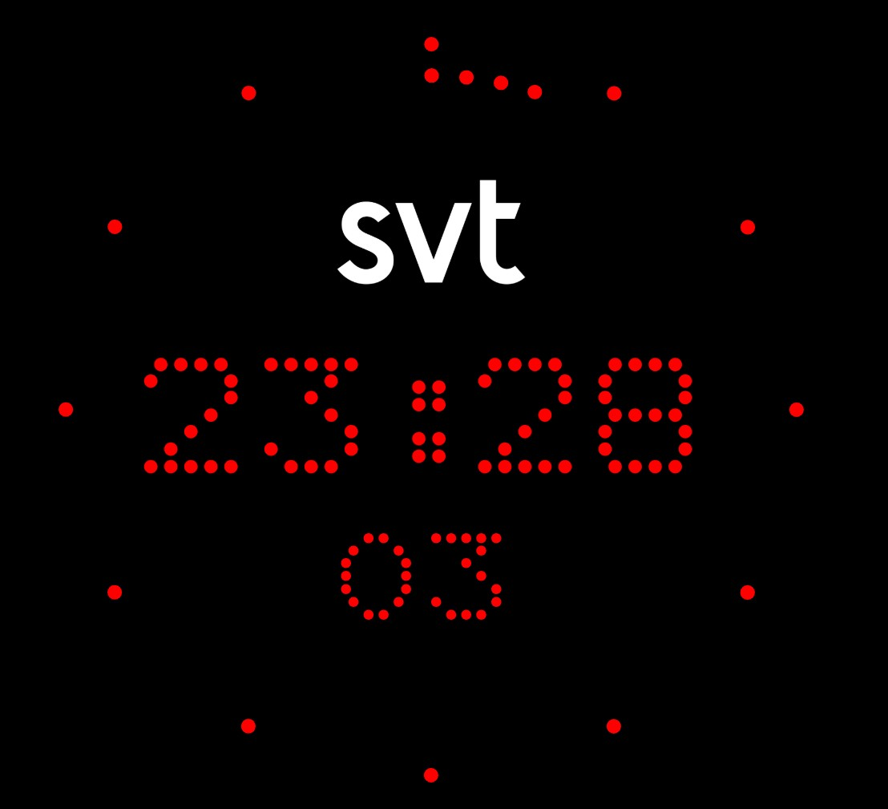

# Studio Clock

A web-based replica of an LED studio clock designed for broadcasting environments. It displays the current time using the system clock (with potential for NTP/chronyd synchronization) and includes a custom logo. The clock features a smooth animation with a configurable update interval and an LED-style display using the Dotrice font.

## Table of Contents
- [About the Project](#about-the-project)
- [Features](#features)
- [Technologies Used](#technologies-used)
- [Installation](#installation)
- [Usage](#usage)
- [Configuration](#configuration)
- [License](#license)

## About the Project
The Studio Clock is a lightweight web application that mimics an LED studio clock used in TV or radio broadcasting. It displays the current time with hours, minutes, and seconds, styled with the Dotrice font for an LED-like appearance, and includes a custom logo for branding. The clock updates every 40ms for smooth animation and reloads every 10 minutes to prevent time drift. While currently using the system clock, it can be extended to synchronize with a local NTP or chronyd service.



## Features
- Real-time clock display with hours, minutes, and blinking seconds colon.
- Custom logo display with a red LED-style filter.
- LED-style text using the Dotrice font.
- Smooth animation with 40ms update intervals.
- Periodic page reload (every 10 minutes) to prevent time drift.
- SVG-based rendering for scalable display.
- Configurable update interval and logo.

## Technologies Used
- **HTML5**: Core structure of the application.
- **CSS**: Styling with custom font and SVG effects.
- **JavaScript**: Time display and animation logic.
- **SVG**: Rendering the clock and logo.
- **Dotrice Font**: LED-style text display.

## Installation
1. **Clone the Repository**:
   ```bash
   git clone https://github.com/nt74/studio-clock.git
   cd studio-clock
   ```

2. **Set Up a Local Server**:
   - Use a local web server to serve the files (recommended for proper font and image loading):
     ```bash
     python -m http.server 8000
     ```
   - Alternatively, open `index.html` directly in a browser, but some features (e.g., font loading) may not work correctly.

3. **Optional NTP/Chronyd Integration**:
   - The current version uses the system clock (`Date`). To sync with an NTP or chronyd service, integrate an NTP library (e.g., `ntp-client`) and update the JavaScript in `index.html` (see [Configuration](#configuration)).

## Usage
1. Open the application in a web browser:
   - Navigate to `http://localhost:8000` (or your server’s address).
2. The clock will display the current system time with hours, minutes, and seconds, styled in an LED-like format.
3. The logo (`logo.png`) will appear above the time with a red filter.
4. The colon between hours and minutes blinks at 1Hz for visual effect.
5. The page reloads every 10 minutes to ensure time accuracy.

## Configuration
- **Update Interval**: Modify the `UPDATE_INTERVAL` constant in `index.html` to change the clock update frequency (default: 40ms for 25fps):
  ```javascript
  const UPDATE_INTERVAL = 40; // Update every 40ms
  ```
- **Reload Interval**: Adjust the `RELOAD_INTERVAL` constant to change how often the page reloads to prevent drift (default: 10 minutes):
  ```javascript
  const RELOAD_INTERVAL = 600000; // Reload every 10 minutes
  ```
- **Logo**: Replace `logo.png` with your custom logo image. Ensure it fits the dimensions (100x50 pixels) specified in the SVG:
  ```html
  <image class="logo" x="150" y="90" width="100" height="50" href="logo.png"/>
  ```
- **NTP Integration**: To sync with an NTP server, add an NTP library and modify the `updateClock` function in `index.html`. Example placeholder:
  ```javascript
  const ntpServer = 'pool.ntp.org';
  // Add NTP client logic here
  ```
## License
- **Project License**: Distributed under the BSD 2-Clause License. See `LICENSE` for more information.
- **Font License**: The Dotrice font (`Dotrice-Regular.otf`) is licensed under the SIL Open Font License, Version 1.1. Copyright (c) 2010, Paul Flo Williams (paul@frixxon.co.uk), with Reserved Font Name Dotrice. See [openfontlicense.org](https://openfontlicense.org) for the full license text.
